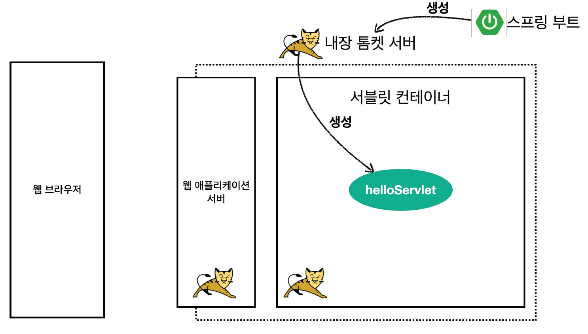
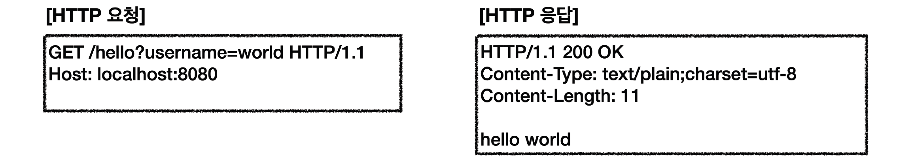
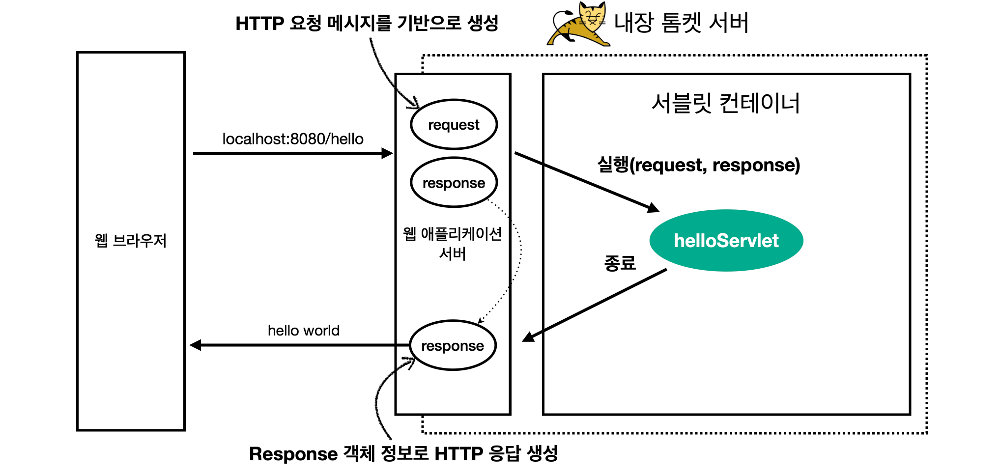

# Hello 서블릿

스프링 부트 환경에서 서블릿을 등록하고 사용해보자.

> 서블릿이랑 스프링 부트랑 상관이 없는데 왜 스프링 부트 환경인가?
> 
> 서블릿은 톰캣같은 웹 애플리케이션 서버를 직접 설치하고, 그 위에 서블릿 코드를 클래스 파일로 빌드해서 올린다음, 톰캣 서버를 실행하면 된다. 하지만 이 과정은 매우 번거롭다.
> 스프링 부트는 톰캣 서버를 내장하고 있으므로, 톰캣 서버 설치 없이 편리하게 서블릿 코드를 실행할 수 있다.

## 스프링 부트 서블릿 환경 구성

`@ServletComponentScan`  
스프링 부트는 서블릿을 직접 등록해서 사용할 수 있도록 `@ServletComponentScan`을 지원한다. 다음과 같이 추가하자.

### hello.servlet.ServletApplication
```java
@ServletComponentScan // 서블릿 자동 등록
@SpringBootApplication
public class ServletApplication {

    public static void main(String[] args) {
        SpringApplication.run(ServletApplication.class, args);
    }
}
```

### 서블릿 등록하기
처음으로 실제 동작하는 서블릿 코드를 등록해보자.

### hello.servlet.basic.HelloServlet

```java
@WebServlet(name = "helloServlet", urlPatterns = "/hello")
public class HelloServlet extends HttpServlet {
    @Override
    protected void service(HttpServletRequest request, HttpServletResponse response) throws ServletException, IOException {
        System.out.println("HelloServlet.service");
        System.out.println("request = " + request);
        System.out.println("response = " + response);

        String username = request.getParameter("username");
        System.out.println("username = " + username);

        response.setContentType("text/plain");
        response.setCharacterEncoding("utf-8");
        response.getWriter().write("hello " + username);
    }
}
```

- `@WebServlet` 서블릿 애노테이션
  - name : 서블릿 이름
  - urlPatterns : URL 매핑
  - name과 urlPatterns는 중복이 있으면 안 된다.


HTTP 요청을 통해 매핑된 URL이 호출되면 서블릿 컨테이너는 다음 메서드를 실행한다.
```java
protected void service(HttpServletRequest request, HttpServletResponse response)
```

- 웹 브라우저 실행
  - http://localhost:8080/hello?username=han
  - 결과 : hello han
- 콘솔 실행결과
  ```less
  HelloServlet.service
  request = org.apache.catalina.connector.RequestFacade@74745e77
  response = org.apache.catalina.connector.ResponseFacade@d77d397
  username = han
  ```
  
> 주의
> 
> IntelliJ 무료 버전을 사용하는데, 서버가 정상 실행되지 않는다면 **프로젝트 생성** -> **IntelliJ Gradle 대신에 자바
직접 실행**에 있는 주의 사항을 읽어보자.


## HTTP 요청 메시지 로그로 확인하기

다음 설정을 추가하자.

### application.properties

```properties
logging.level.org.apache.coyote.http11=debug
```

서버를 다시 시작하고 요청해보면, 서버가 받은 HTTP 요청 메시지를 출력하는 것을 확인할 수 있다.

```groovy
...

2024-07-15 22:29:36.260 DEBUG 36072 --- [nio-8080-exec-1] o.a.coyote.http11.Http11InputBuffer      : Received [GET /hello?username=%ED%95%9C HTTP/1.1
Host: localhost:8080
Connection: keep-alive
Cache-Control: max-age=0
sec-ch-ua: "Not/A)Brand";v="8", "Chromium";v="126", "Google Chrome";v="126"
sec-ch-ua-mobile: ?0
sec-ch-ua-platform: "Windows"
Upgrade-Insecure-Requests: 1
User-Agent: Mozilla/5.0 (Windows NT 10.0; Win64; x64) AppleWebKit/537.36 (KHTML, like Gecko) Chrome/126.0.0.0 Safari/537.36
Accept: text/html,application/xhtml+xml,application/xml;q=0.9,image/avif,image/webp,image/apng,*/*;q=0.8,application/signed-exchange;v=b3;q=0.7
Sec-Fetch-Site: none
Sec-Fetch-Mode: navigate
Sec-Fetch-User: ?1
Sec-Fetch-Dest: document
Accept-Encoding: gzip, deflate, br, zstd
Accept-Language: ko-KR,ko;q=0.9,en-US;q=0.8,en;q=0.7

]
```


> 참고
> 
> 운영서버에 이렇게 모든 요청 정보를 다 남기면 성능저하가 발생할 수 있다. 개발 단계에서만 적용하자.

## 서블릿 컨테이너 동작 방식 설명

### 내장 톰캣 서버 생성



### HTTP 요청, HTTP 응답 메시지



### 웹 애플리케이션 서버의 요청 응답 구조



> 참고
> 
> HTTP 응답에서 Content-Length는 웹 애플리케이션 서버가 자동으로 생성해준다.

## welcome 페이지 추가

